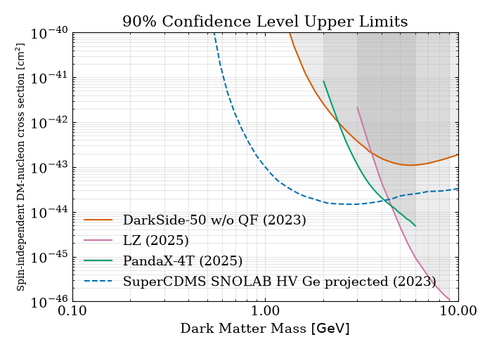

# QuantumDMLimits

[](https://opensource.org/licenses/mit-license.php)

An open-source plotting tool for compiling public dark matter direct detection limits. The goal of this repository is to collect exclusion limits and projected sensitivities from published dark matter direct detection experiments (e.g. DarkSide, LZ, PandaX, SuperCDMS) into a common set of digitized curves, and to provide notebooks for reproducing publication-quality comparison plots from them.

Curves are gathered either by digitizing figures from papers (via `qdmlimits`'s pixel-extraction tools), reading data released alongside a publication (e.g. HEPData YAML), or parsing native experiment data files (e.g. MATLAB `.mat` sensitivity outputs). Each digitized curve is saved as a plain CSV so it can be reused across plots without repeating the extraction step.

**Disclaimer:** limits collected here come from a wide range of papers with differing conventions, assumptions, and levels of statistical rigor — some are observed exclusions, others are projected/future sensitivities. Digitized curves are approximations of the original published figures and may carry some pixel-extraction error. Always check the original source before relying on a curve for quantitative work.

## Repository layout

- `qdmlimits/` — the core Python package: PDF/image loading (`pdf.py`), axis calibration (`calibration.py`), and curve extraction (`extraction.py`).
- `curves/` — one subdirectory per source (paper, experiment, or data release), each with an `outputs/` folder of digitized CSV curves.
- `notebooks/` — one `digitize_*.ipynb` notebook per source curve, plus `plot_curves.ipynb` which combines the digitized curves into comparison plots.

## Getting started

```bash
conda env create -f environment.yml
conda activate qdmlimits
pip install -e .
```

Then open any `notebooks/digitize_*.ipynb` to extract a new curve, or `notebooks/plot_curves.ipynb` to reproduce the combined limit plot.

---

[](plots/SuperCDMS_SNOLAB_focused_comparison/dm_limits_comparison.pdf)

### **SuperCDMS SNOLAB focused comparison**
Plot ([pdf](plots/SuperCDMS_SNOLAB_focused_comparison/dm_limits_comparison.pdf), [png](plots/SuperCDMS_SNOLAB_focused_comparison/dm_limits_comparison.png))

References:
- *DarkSide-50 2023 w/o QF*, [PHYSICAL REVIEW D 107, 063001 (2023)](https://journals.aps.org/prd/pdf/10.1103/PhysRevD.107.063001)
- *LZ 2025*, [arXiv:2512.08065](https://arxiv.org/abs/2512.08065)
- *PandaX-4T 2025*, [PHYSICAL REVIEW LETTERS 135, 211001 (2025)](https://journals.aps.org/prl/pdf/10.1103/rtnh-jn8s)
- *SuperCDMS SNOLAB HV Ge Projected Sensitivity*, [arXiv:2203.08463](https://arxiv.org/pdf/2203.08463)

---
